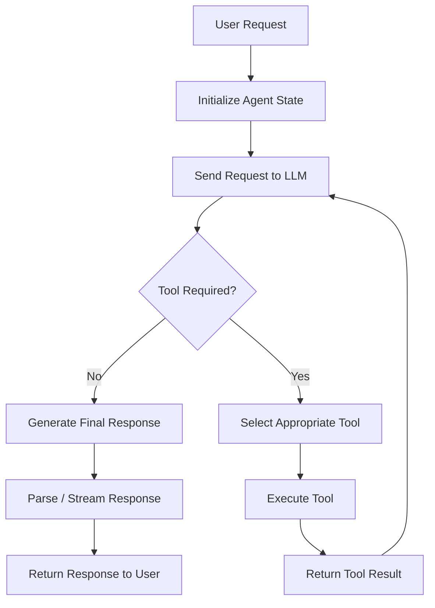

# 🚀 LangChain & Groq — Zero to Hero AI Engineering Curriculum

> **A practical, production-oriented curriculum for building modern LLM applications with Python, LangChain, Groq, RAG, Tool Calling, Agents, and LangGraph.**

[](https://www.python.org/)
[](https://docs.langchain.com/)
[](https://groq.com/)
[](https://www.langchain.com/langgraph)
[](LICENSE)

---

## 🎯 About This Curriculum

**LangChain & Groq — Zero to Hero** is a hands-on learning repository designed to take you from your **first LLM API call** to building **agentic AI systems and RAG applications**.

The curriculum focuses on understanding **how modern LLM applications are actually built**, rather than simply copying framework code.

You will progressively learn:

* 🧠 LLM application fundamentals
* 📝 Prompt engineering and templates
* 🔗 LCEL pipelines
* ⚙️ Sequential and multi-step workflows
* 📦 Structured LLM outputs
* 🛠️ Custom tools and tool calling
* 🤖 AI agents
* 📚 Retrieval-Augmented Generation (RAG)
* 🗄️ Vector databases
* 💾 Conversational state and memory
* ⚡ Streaming
* 🕸️ LangGraph orchestration
* 🔍 Observability with LangSmith
* 🚀 Production-oriented AI architecture

---

# 🏗️ System Architecture

The curriculum gradually builds the following architecture:

```text
                         ┌───────────────────────┐
                         │   USER / APPLICATION   │
                         └───────────┬───────────┘
                                     │
                                     ▼
                         ┌───────────────────────┐
                         │      LANGCHAIN        │
                         │   Application Layer   │
                         └───────────┬───────────┘
                                     │
             ┌───────────────────────┼───────────────────────┐
             │                       │                       │
             ▼                       ▼                       ▼
      ┌─────────────┐        ┌─────────────┐        ┌──────────────┐
      │   Prompts   │        │    LCEL     │        │  Structured  │
      │  Templates  │        │  Pipelines  │        │    Output    │
      └──────┬──────┘        └──────┬──────┘        └──────┬───────┘
             │                      │                       │
             └──────────────────────┼───────────────────────┘
                                    │
                                    ▼
                         ┌───────────────────────┐
                         │       AGENTS          │
                         │  Reason + Act + Tool  │
                         └───────────┬───────────┘
                                     │
                     ┌───────────────┴───────────────┐
                     │                               │
                     ▼                               ▼
          ┌─────────────────────┐        ┌─────────────────────┐
          │     GROQ / LLM      │        │   EXTERNAL TOOLS    │
          │                     │        │                     │
          │ • Llama Models      │        │ • Python Functions  │
          │ • Fast Inference    │        │ • Vector Stores     │
          │ • Chat Models       │        │ • Search APIs       │
          └─────────────────────┘        └─────────────────────┘
```

---

# 🤖 Agent Execution Flow

A modern agent can follow a reasoning → tool → observation loop:



The goal is not simply to call an LLM, but to understand how an application can **orchestrate models, tools, state, and external knowledge**.

---

# 📚 RAG Architecture

Retrieval-Augmented Generation is one of the most important patterns for production LLM applications.

## Phase 1 — Indexing

```text
┌──────────────┐
│ PDFs / Text  │
│ Documents    │
└──────┬───────┘
       │
       ▼
┌────────────────┐
│ Document Loader│
└──────┬─────────┘
       │
       ▼
┌────────────────┐
│ Text Splitter  │
└──────┬─────────┘
       │
       ▼
┌────────────────┐
│ Text Chunks    │
└──────┬─────────┘
       │
       ▼
┌────────────────┐
│ Embedding Model│
└──────┬─────────┘
       │
       ▼
┌────────────────┐
│ Vector Store   │
│ Chroma / Qdrant│
└────────────────┘
```

## Phase 2 — Retrieval + Generation

```text
┌──────────────┐
│ User Question│
└──────┬───────┘
       │
       ▼
┌────────────────┐
│ Query Embedding│
└──────┬─────────┘
       │
       ▼
┌─────────────────────┐
│ Similarity Search   │
└──────────┬──────────┘
           │
           ▼
┌─────────────────────┐
│ Relevant Documents  │
└──────────┬──────────┘
           │
           ▼
┌─────────────────────┐
│ Context + Question  │
└──────────┬──────────┘
           │
           ▼
┌─────────────────────┐
│      Groq LLM       │
└──────────┬──────────┘
           │
           ▼
┌─────────────────────┐
│   Final Answer      │
└─────────────────────┘
```

---

# 🎓 Learning Path

The curriculum is structured progressively.

| #  | File                          | Topic                | What You Learn                            |
| -- | ----------------------------- | -------------------- | ----------------------------------------- |
| 01 | `01_setup_and_basic_llm.py`   | 🧠 LLM Fundamentals  | ChatGroq, API keys, model invocation      |
| 02 | `02_prompt_templates.py`      | 📝 Prompt Templates  | Dynamic prompts and reusable templates    |
| 03 | `03_lcel_chains.py`           | 🔗 LCEL              | Pipeline composition using `\|`           |
| 04 | `04_sequential_workflow.py`   | ⚙️ Workflows         | Multi-step sequential processing          |
| 05 | `05_structured_output.py`     | 📦 Structured Output | Pydantic schemas and typed responses      |
| 06 | `06_tools.py`                 | 🛠️ Tools            | Building custom Python tools              |
| 07 | `07_agents.py`                | 🤖 Agents            | Tool selection and agent execution        |
| 08 | `08_rag_inmemory.py`          | 📚 RAG Fundamentals  | Embeddings, retrieval and semantic search |
| 09 | `09_rag_chroma.py`            | 🗄️ Vector Database  | Persistent vector storage                 |
| 10 | `10_memory_agent.py`          | 💾 Memory            | Stateful conversations and checkpoints    |
| 11 | `11_streaming.py`             | ⚡ Streaming          | Real-time model output                    |
| 12 | `12_langgraph_intro.py`       | 🕸️ LangGraph        | State, nodes and graph orchestration      |
| 13 | `13_capstone_ai_assistant.py` | 🚀 Capstone          | Build an end-to-end AI assistant          |

---

# 🧠 What You Will Build

By the end of this curriculum, you should be able to build systems such as:

### 📄 AI Document Assistant

```text
PDFs
 ↓
Document Loader
 ↓
Chunking
 ↓
Embeddings
 ↓
Vector Database
 ↓
Retriever
 ↓
LLM
 ↓
Answer
```

### 🤖 AI Agent

```text
User
 ↓
LLM
 ↓
Decision
 ├── Calculator
 ├── Search
 ├── Database
 └── Custom Python Tool
 ↓
Final Response
```

### 🧠 Agentic RAG

```text
                 User Question
                       │
                       ▼
                    Agent
                       │
              ┌────────┴────────┐
              ▼                 ▼
          Retriever          Tools
              │                 │
              └────────┬────────┘
                       ▼
                      LLM
                       │
                       ▼
                Final Answer
```

---

# ⚡ Prerequisites

You should have:

* Python **3.10+**
* Basic Python programming knowledge
* Functions and classes
* Basic understanding of APIs
* Basic understanding of JSON
* A Groq API key

You **do not** need prior LangChain experience.

---

# 🚀 Getting Started

## 1. Clone the repository

```bash
git clone https://github.com/YOUR_USERNAME/langchain-groq-curriculum.git

cd langchain-groq-curriculum
```

## 2. Install dependencies

```bash
pip install -U -r requirements.txt
```

## 3. Configure your Groq API key

### Linux / macOS

```bash
export GROQ_API_KEY="your_api_key"
```

### Windows PowerShell

```powershell
$env:GROQ_API_KEY="your_api_key"
```

### Google Colab

```python
import os
from getpass import getpass

os.environ["GROQ_API_KEY"] = getpass(
    "Enter your Groq API key: "
)
```

---

# 🔐 Security

**Never commit API keys to GitHub.**

❌ Never do this:

```python
os.environ["GROQ_API_KEY"] = "gsk_real_secret_key"
```

Instead, load the key from:

* Environment variables
* Google Colab Secrets
* `.env` files excluded by `.gitignore`
* A production secret manager

The repository includes:

```text
.env.example
.gitignore
```

to help keep secrets separate from source code.

---

# 🧪 Recommended Learning Method

Don't just run the examples.

For every lesson:

### Step 1 — Run

Execute the original example.

### Step 2 — Understand

Identify:

* Input
* Prompt
* Model
* Chain
* Tool
* Output

### Step 3 — Modify

Change the use case.

For example:

```text
Original:
Colorful Socks Company
        ↓
Change to:
Resume Analyzer
        ↓
Change to:
Financial Assistant
        ↓
Change to:
Customer Support Bot
```

### Step 4 — Build

Create your own version without copying the example.

This **Run → Understand → Modify → Build** approach is strongly recommended.

---

# 🔍 Observability with LangSmith

For advanced development, use LangSmith to inspect and debug LLM applications.

Example environment configuration:

```bash
export LANGSMITH_TRACING="true"
export LANGSMITH_API_KEY="your_langsmith_api_key"
```

Tracing helps you understand:

```text
User Input
    ↓
Prompt
    ↓
LLM
    ↓
Tool
    ↓
Retriever
    ↓
LLM
    ↓
Final Output
```

This becomes especially valuable when debugging complex agents and RAG pipelines.

---

# 📦 Repository Structure

```text
langchain-groq-curriculum/
│
├── 📄 README.md
├── 📄 requirements.txt
├── 📄 .env.example
├── 📄 .gitignore
│
├── 🧠 01_setup_and_basic_llm.py
├── 📝 02_prompt_templates.py
├── 🔗 03_lcel_chains.py
├── ⚙️ 04_sequential_workflow.py
├── 📦 05_structured_output.py
├── 🛠️ 06_tools.py
├── 🤖 07_agents.py
├── 📚 08_rag_inmemory.py
├── 🗄️ 09_rag_chroma.py
├── 💾 10_memory_agent.py
├── ⚡ 11_streaming.py
├── 🕸️ 12_langgraph_intro.py
└── 🚀 13_capstone_ai_assistant.py
```

---

# 🧩 Technology Stack

| Technology        | Purpose                         |
| ----------------- | ------------------------------- |
| 🐍 **Python**     | Core programming language       |
| 🔗 **LangChain**  | LLM application framework       |
| ⚡ **Groq**        | High-speed LLM inference        |
| 🦙 **Llama**      | Foundation models               |
| 🕸️ **LangGraph** | Stateful workflow orchestration |
| 📚 **Chroma**     | Vector storage and retrieval    |
| 🧠 **Embeddings** | Semantic representation         |
| 📦 **Pydantic**   | Structured data validation      |
| 🔍 **LangSmith**  | Observability and tracing       |

---

# 🗺️ From Beginner to Production

```text
                    BEGINNER
                       │
                       ▼
                 Basic LLM Calls
                       │
                       ▼
                Prompt Templates
                       │
                       ▼
                     LCEL
                       │
                       ▼
              Sequential Workflows
                       │
                       ▼
               Structured Output
                       │
                       ▼
                     Tools
                       │
                       ▼
                    Agents
                       │
                       ▼
                      RAG
                       │
                       ▼
              Vector Databases
                       │
                       ▼
                    Memory
                       │
                       ▼
                  LangGraph
                       │
                       ▼
                Agentic RAG
                       │
                       ▼
              Observability
                       │
                       ▼
              Production AI Apps
```

---

# 🚀 Capstone Project

The final objective is to build a practical **AI Assistant** capable of combining:

* LLM inference
* Prompt templates
* Structured output
* Custom tools
* Retrieval
* Vector databases
* Conversational state
* Agent workflows
* LangGraph orchestration

A simplified architecture:

```text
                    USER
                      │
                      ▼
              ┌───────────────┐
              │ AI ASSISTANT  │
              └───────┬───────┘
                      │
             ┌────────┴────────┐
             │                 │
             ▼                 ▼
           AGENT              RAG
             │                 │
       ┌─────┼─────┐           │
       ▼     ▼     ▼           ▼
     Tools Search DB       Vector Store
       │     │     │           │
       └─────┴─────┴─────┬─────┘
                          │
                          ▼
                       GROQ
                          │
                          ▼
                   FINAL RESPONSE
```

---

# 📈 Suggested Next Steps

After completing this repository, continue with:

1. Advanced RAG
2. Hybrid Search
3. Re-ranking
4. Agentic RAG
5. LangGraph conditional workflows
6. Human-in-the-loop systems
7. Evaluation
8. LangSmith
9. Guardrails
10. Production deployment
11. FastAPI integration
12. Docker
13. Cloud deployment

---

# 📖 Official Resources

* 📚 [LangChain Documentation](https://docs.langchain.com/)
* ⚡ [ChatGroq Integration](https://docs.langchain.com/oss/python/integrations/chat/groq)
* 🤖 [LangChain Agents](https://docs.langchain.com/oss/python/langchain/agents)
* 🕸️ [LangGraph](https://www.langchain.com/langgraph)
* 🔍 [LangSmith](https://www.langchain.com/langsmith)
* ⚡ [Groq](https://groq.com/)

---

# 🤝 Contributing

Contributions are welcome.

If you find an issue or have an improvement:

1. Fork the repository
2. Create a feature branch
3. Make your changes
4. Test your changes
5. Submit a Pull Request

Please keep examples:

* Simple
* Reproducible
* Well documented
* Compatible with the current package APIs

---

# ⭐ Support the Project

If this curriculum helps you learn LangChain or build your first AI application:

⭐ **Star this repository**

🍴 **Fork it**

📢 **Share it with other AI/ML learners**

---

# 📜 License

This project is intended for educational purposes.

Add an appropriate open-source license file such as `MIT` if you want others to freely reuse and modify the material.

---

## 🎯 The Goal

> **Don't just learn how to call an LLM. Learn how to engineer complete AI systems around it.**

**Python → LangChain → RAG → Agents → LangGraph → Production AI**
